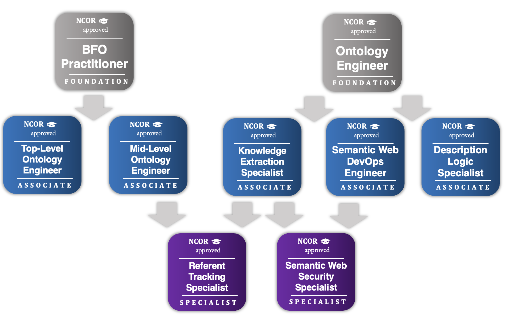

# NCOR Certificate Pathways

Foundational Certificates
- BFO: Basic Formal Ontology Practitioner
- ONE: Ontology Engineer

Associate Certificates
- KES: Knowledge Extraction Specialist (Prerequisite: ONE)
- SWD: Semantic Web DevOps Engineer (Prerequisite: ONE)
- TLO: Top-Level Ontology Engineer (Prerequisite: BFO)
- MLO: Mid-Level Ontology Engineer (Prerequisite: BFO)

Specialist Certificates
- SWS: Semantic Web Security Specialist (Prerequisites: KES, SWD)
- RTE: Referent Tracking Specialist (Prerequisites: KES, MLO)
- DLS: Description Logic Specialist (Prerequisites: KES, SWD)

## Basic Formal Ontology ISO/IEC 21838:2 Specialist

Participants will gain facility with applying BFO classes and relations to a range of practical modeling problems while maintaining conformance to the top-level ontology 21838:2 specification. A standard training package consists of four days, 4 hours per day, for a total of 16 hours. An expedited training package consists of two days, 8 hours per day, for a total of 16 hours. Topics covered include:

Construction and application of BFO-conformant design patterns
Translating natural language into BFO-conformant terminology
Use of BFO and extensions - such as the Common Core Ontologies suite - to represent intelligence gathering, defense, and cyber security
Motivation for and critical analysis of the BFO hierarchy
Comparison of BFO modeling choice-points to those found in other top-level ontology architectures
 

### Tentative Schedule (4 Day)

Day 1

Top-Level Principles of BFO
The BFO Hierarchy
Formal Implementations of BFO
Day 2

From Natural Language to BFO Implementations
BFO-Conformant Design Patterns
Participant Evaluation
Day 3

Extending BFO using Common Core Ontologies
BFO/CCO-Conformant Design Patterns
From Natural Language to BFO/CCO
Day 4

Upper-Level Rivals to BFO: DOLCE, YAMATO
Critical Comparison of Upper-Level Ontologies
Participant Evaluation
 
Expedited schedule merges Day 1 and 2, and Day 3 and 4, holding an evaluation each day. Participants will be evaluated by way of two exams, consisting of multiple choice and essay questions designed to check competency with the material covered. Successful completion of this credential requires an average of 70 across both exams.
 
## Applied Ontology Engineering Specialist 

Aimed at cultivating expertise with ontology engineering technologies, and promoting facility with constructing, maintaining, and curating ontologies in a modern software development workflow. A standard training package consists of four days, 4 hours per day, for a total of 16 hours. An expedited training package consists of two days, 8 hours per day, for a total of 16 hours. Participants will be expected to engage in problem-solving sessions in class designed to promote mastery of technologies such as:

The semantic web stack, e.g. RDF, RDFs, and OWL2
Protégé editor for domain ontology modeling
Github for version control workflows
SPARQL for ontology information extraction
SHACL for ontology validation
 
### Tentative Schedule (4 Day)

Day 1

RDF and RDFS
OWL2 Full
OWL2 DL Direct Semantics
Day 2

Principles of Version Control
Building Ontologies in Protégé
Editing Ontologies in RDF Serializations
Participant Evaluation
Day 3

SPARQL as a Protocol Language
SPARQL as a Query Language
From Natural Language to SPARQL
Day 4

SHACL as a Validation Language
OWL2+SPARQL+SHACL Development Pipeline
Participant Evaluation
 
Expedited schedule merges Day 1 and 2, and Day 3 and 4, holding an evaluation each day. Participants will be evaluated by way of two exams, consisting of multiple choice and essay questions designed to check competency with the material covered. Successful completion of this credential requires an average of 70 across both exams. 